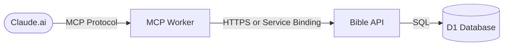

# Bible MCP Server

A public MCP (Model Context Protocol) server that provides Bible verse lookup and search capabilities, powered by a custom Bible API hosted on Cloudflare Workers with D1.

**Landing Page:** https://bible-mcp.dws-cloud.com
**MCP Endpoint:** `https://bible-mcp.dws-cloud.com/mcp`

## Features

- 📖 **Get Verse** - Retrieve any verse, range, or chapter
- 🔍 **Search Bible** - Full-text search with book/testament filters
- 📚 **List Books** - Browse all 86 books including Apocrypha
- 🌍 **Multiple Translations** - KJV and World English Bible
- 🎲 **Random Verse** - With optional book/testament filters

## Available Tools

| Tool | Description |
|------|-------------|
| `get_verse` | Fetch verses by reference (e.g., "John 3:16", "Psalm 23", "Romans 8:28-39") |
| `get_chapter` | Get a full chapter with navigation hints for sequential reading |
| `search_bible` | Search for words/phrases with book and testament filters |
| `list_books` | List Bible books with chapter counts, filterable by testament |
| `list_translations` | Show available translations |
| `get_random_verse` | Get a random verse, optionally filtered by book or testament |

## Supported Translations

- `web` - World English Bible (default)
- `kjv` - King James Version

## Development

### Prerequisites

- Node.js 18+
- A Cloudflare account (for deployment)

### Setup

```bash
npm install
npm run dev
```

Your MCP server will be running at `http://localhost:8787/mcp`

### Testing with MCP Inspector

```bash
npm run inspect
```

Then enter `http://localhost:8787/mcp` in the inspector.

## Deployment

```bash
npm run deploy
```

## Connecting to Claude.ai

1. Go to Claude.ai Settings → Connectors
2. Add the MCP server URL: `https://bible-mcp.dws-cloud.com/mcp`
3. The Bible tools will now be available in your conversations

## Example Usage

Once connected, you can ask Claude things like:

- "Look up John 3:16"
- "Search the Bible for 'faith' in the New Testament"
- "Show me a random Psalm"
- "List the books of the Apocrypha"
- "Get Romans 8:28-39 in KJV"

## Architecture



- **MCP Server:** Cloudflare Worker with MCP protocol handler
- **Bible API:** REST API providing verse data ([GitHub](https://github.com/tuxr/bible-api))
- **Database:** Cloudflare D1 with 74,000+ verses
- **Search:** Full-text search via FTS5 index

### API Connection Options

The MCP server can connect to the Bible API in two ways:

| Option | Use Case | Configuration |
|--------|----------|---------------|
| **Public API** | Use the hosted API, or deploy to a different Cloudflare account | Set `BIBLE_API_URL` in wrangler.toml |
| **Service Binding** | Both workers in the same Cloudflare account (faster) | Configure `[[services]]` in wrangler.toml |

**Using the public API (default):**
```toml
[vars]
BIBLE_API_URL = "https://bible-api.dws-cloud.com"
```

**Using a service binding (same account):**
```toml
[[services]]
binding = "BIBLE_API"
service = "your-bible-api-worker-name"  # Your worker's name
```

> **Note:** The `binding` must be `BIBLE_API` (this matches the code). The `service` is whatever you named your Bible API worker when you deployed it.

## License

MIT
